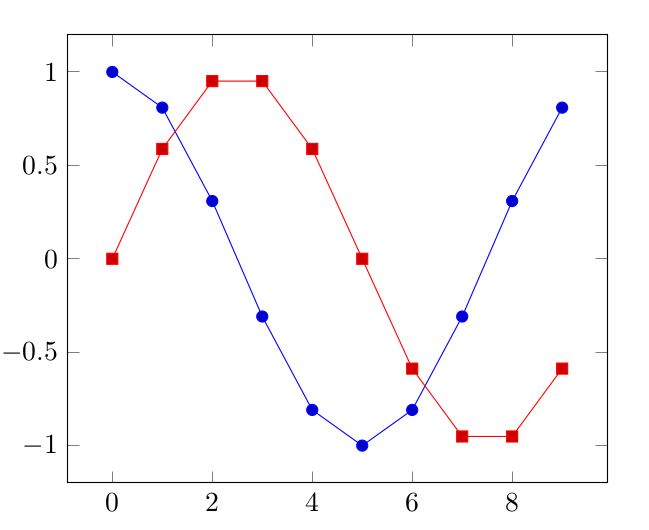

# PyXport python3 module

## Quick description

This module defines two functions to output scientific data:

* plot2im: This function saves the plotted image when using matplotlib.pyplot matshow as an image.
* save_dat: Save data to .dat file for LaTeX pgfplotstable package usage.


## plot2im function

### Documentation

This function saves the plotted image when using matshow with mat. The colormap is cmap.

The user can define a reference matrix. Its maximum and minimum value will be chosen as the the colormap limits. Above (resp. below) values will be thresholded to the colormap upper (resp. lower) limit.

Arguments | Type | Description
----------|------|------------
mat | numpy array | The data matrix.
loc |str | The saving location.
reference | numpy array, optional | A reference matrix.
cmap | str, optional | The colormap. Default is viridis.


### Example

```
import scipy.misc
import PyXport

matrix = scipy.misc.face(gray=True)

PyXport.plot2im(matrix, loc='viridis.png')
PyXport.plot2im(matrix, loc='plasma.png', cmap='plasma')
PyXport.plot2im(matrix, loc='rainbow.png', cmap='rainbow')
```


## save_dat function

### Documentation

Save data to .dat file for LaTeX pgfplotstable package usage.

This function accepts three types of data.

1. A Numpy array was given. Then, the .dat file will only contain its values separated by newline.
2. A list/typle of one or two Numpy arrays was given. Then, the .dat file will have the values of the different arrays separated by the optional separator sep.
3. A dictionary of Numpy arrays was given. Then, the keys will be given in the first line of the .dat file.

*Note:* In the case of multiple arrays input, the arrays should have the save size. Otherwise, a ValueError will be raised.

Arguments | Type | Description
----------|------|------------
data | 1D array, tuple or list of 1D arrays, dictionary of 1D arrays | Arrays to save.
loc | str | Place to save the data.
sep | str | Data separator. Default is one space.


### Particular note

I wrote this code as I new more about pgfplots configurations than about matplotlib configuration (that I find less natural, maybe because the matplotlib documentation is not really intuitive either :s). All the plot design is then configured in LaTeX.

If you know a lot about matplotlib configuration, you could use the [matplotlib2tikz](https://pypi.org/project/matplotlib2tikz/) project instead.


### Example

```
import numpy as np
import PyXport

x = np.arange(10)
y_cos = np.cos(2*np.pi*x/10)
y_sin = np.sin(2*np.pi*x/10)

PyXport.save_dat({'x': x, 'y_cos': y_cos, 'y_sin': y_sin}, loc='table.dat')
```

table.dat
```
x y_sin y_cos
0.0 0.0 1.0
1.0 -2.4492935982947065e-15 1.0
2.0 -4.898587196589413e-15 1.0
3.0 -2.1558735510086122e-14 1.0
4.0 -9.797174393178826e-15 1.0
5.0 1.964386723728472e-15 1.0
6.0 -4.3117471020172244e-14 1.0
7.0 -3.135590990326495e-14 1.0
8.0 -1.9594348786357652e-14 1.0
9.0 -7.832787669450353e-15 1.0
```

LaTeX code
```
\documentclass{minimal}
\usepackage{tikz, pgf, pgfplots}

\begin{document}

\begin{tikzpicture}
	\begin{axis}
		\addplot+ table[x=x,y=y_cos]{table.dat};
		\addplot+ table[x=x,y=y_sin]{table.dat};
	\end{axis}
\end{tikzpicture}


\end{document}
```

Output




## License

This code is distributed under the MIT license. Feel free to use it.

Author: [Etienne MONIER](https://github.com/etienne-monier)

